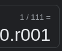
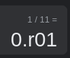
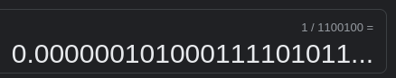
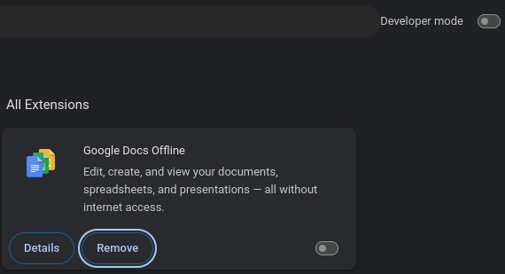
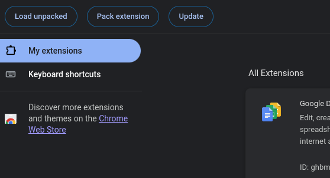

# Binary Converter Extension
This is an extension that can be added to chrome or firefox, that converts each number displayed into its binary equivalent.

### Radix approximations
It uses r-notation to denote repeating numerals after the radix point. Unfortunately, most decimal representations don't have a way to indicate this repetition, so it has to guess.
Here is the radix approximator in action


The approximator sometimes over-corrects, so be careful in relying on it.




## Installing
In a folder of your choosing

```
git clone https://github.com/TremblingInferno/BinaryConverter.git
```

### Fire-fox:
Type `about:debugging#runtime/this-firefox` in the search bar, then click "load temporary add-on..." 

Select manifest.json.
Unfortunately, the extension will have to be reloaded everytime you open a new fire-fox window.

### Chrome:
Go to `chrome://extensions` turn on developer mode,


click "Load unpacked", 


and select the folder you installed.
You will get a warning that says Unrecognized manifest key 'browser_specific_settings', but that won't affect the performance of the extension.

