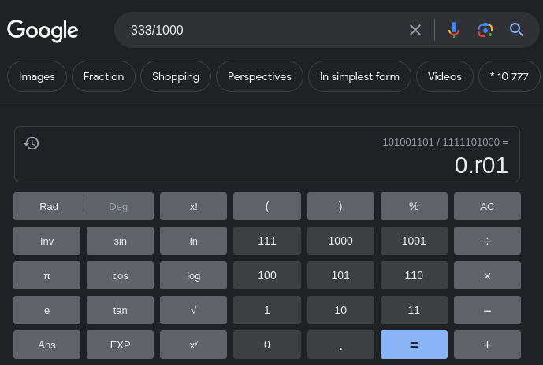

Not sure yet how to make this more accessible, but for testing purposes, go to about:debugging#/runtime/this-firefox , click "load temporary add-on...", and select manifest.json

Here is the radix approximator in action

